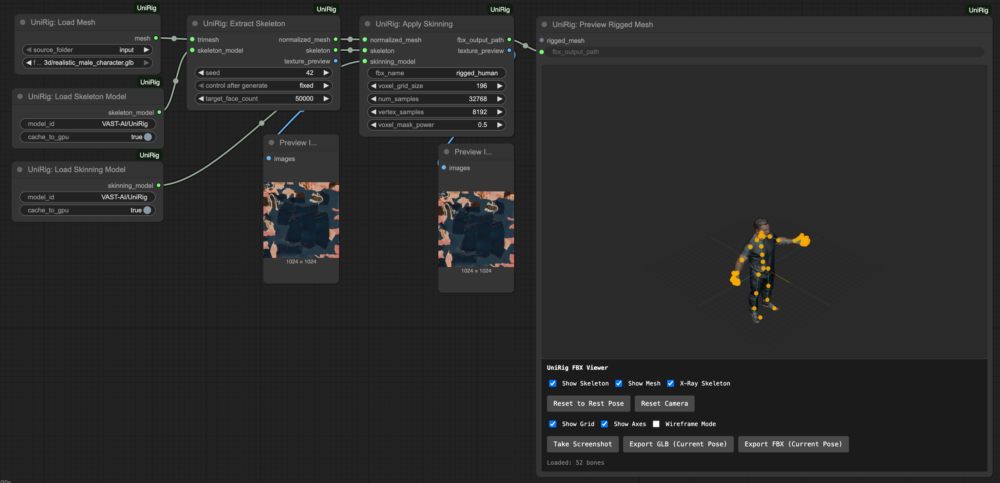
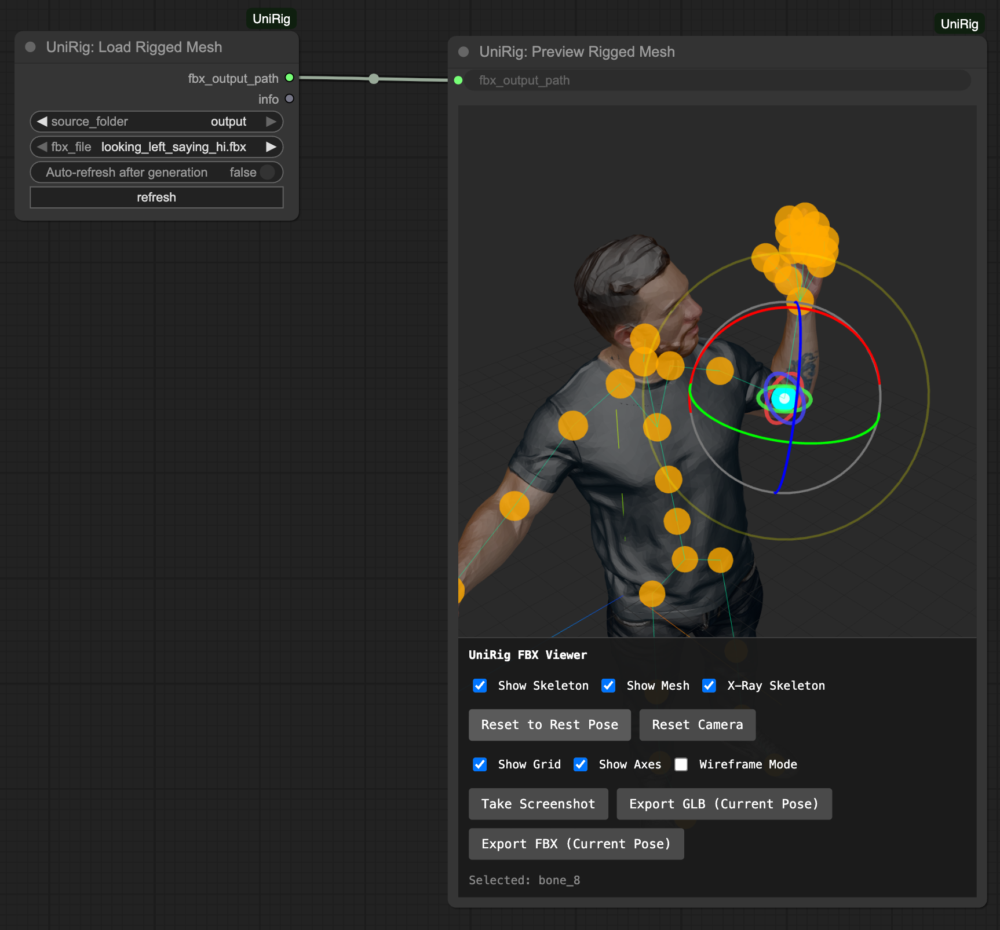

# ComfyUI-UniRig

Automatic skeleton extraction for ComfyUI using UniRig (SIGGRAPH 2025). Self-contained with bundled Blender and UniRig code.

Rig your character mesh and skin it!

Change their pose, export a new one

## Video demos

Rigging/skinning workflow:

Manipulation/saving/export:

## Available Nodes

### Model Loaders
- **UniRig: Load Skeleton Model** - Loads the skeleton extraction model from HuggingFace
- **UniRig: Load Skinning Model** - Loads the skinning weights model from HuggingFace

### Mesh I/O
- **UniRig: Load Mesh** - Loads 3D mesh files (OBJ, FBX, GLB, etc.)
- **UniRig: Save Mesh** - Saves mesh to file

### Skeleton Extraction
- **UniRig: Extract Skeleton** - Extracts skeleton from any 3D mesh using ML
  - Input: TRIMESH mesh, skeleton model
  - Output: Normalized skeleton, normalized mesh, texture preview

### Skinning
- **UniRig: Apply Skinning** - Applies ML-based skinning weights to mesh
  - Input: Normalized mesh, skeleton, skinning model
  - Output: Rigged mesh with skeleton and weights

### Skeleton I/O & Export
- **UniRig: Save Skeleton** - Saves skeleton to JSON file
- **UniRig: Load Rigged Mesh** - Loads a rigged FBX file with skeleton
- **UniRig: Preview Rigged Mesh** - Generates preview image of rigged mesh
- **UniRig: Export Posed FBX** - Exports rigged mesh with custom pose to FBX/GLB

## Features

- **State-of-the-art**: Based on UniRig (SIGGRAPH 2025)
- **Self-contained**: Bundled UniRig code and auto-installing Blender
- **Universal**: Works on humans, animals, objects, any 3D mesh
- **Fast**: Optimized inference pipeline
- **Easy**: One-click install via ComfyUI Manager

## Credits

- [UniRig Paper](https://zjp-shadow.github.io/works/UniRig/)
- [UniRig GitHub](https://github.com/VAST-AI-Research/UniRig)
